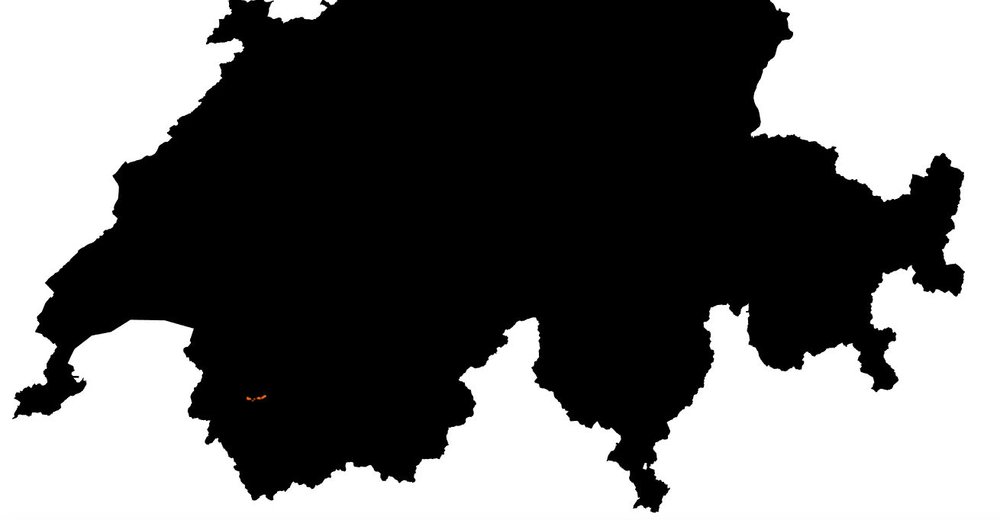

# Dat'Avalanche

[T. Kulak](mailto:thibaut.kulak@idiap.ch) , [E. Pignat](mailto:emmanuel.pignat@idiap.ch), [C. Jaques](mailto:christian.jaques@idiap.ch)

This repository holds all code and data of our project for the "Data Visualisation" course taught at EPFL by [K. Benzi](https://www.kirellbenzi.com/), Fall semester of 2018.

Example of a single GPS trace, from Ovronaz to Dents de Morcles. 


## Repo organization

Should be pretty self-explanatory

```
data ----- viz ----- scripts
```


## Usefull links

* [swiss topo elevation map](http://bl.ocks.org/herrstucki/6312708)
* [swiss maps data](https://github.com/interactivethings/swiss-maps)
* [Leaflet](https://leafletjs.com/)
* [Leaflet heatmap plugin](https://github.com/Leaflet/Leaflet.heat)
* [Camptocamp](https://www.camptocamp.org/)
* [Read xml files with D3](https://github.com/chrissng/d3.gpx)
* [D3 + Leaflet example](http://bl.ocks.org/d3noob/9267535)